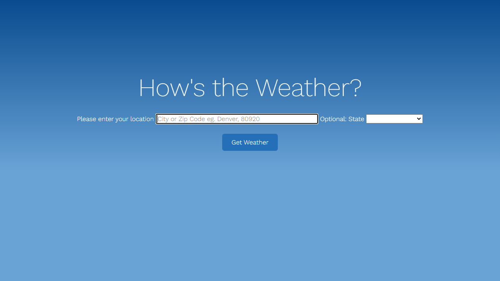
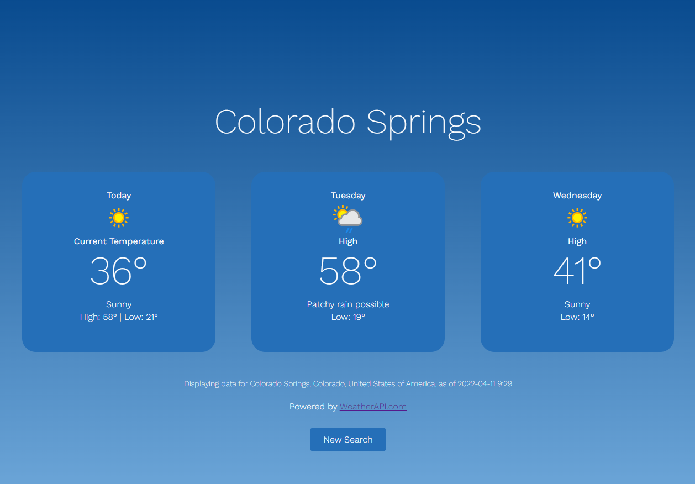

# Production Website

## Deployed Site

View the deployed site [here](https://jonalake.github.io/production-website/).

## Multiple pages

The 'How's The Weather' site collects a user's location using forms and displays a user's current and future weather data for that location by integrating with the [WeatherAPI](https://www.weatherapi.com/).

## Screenshots

